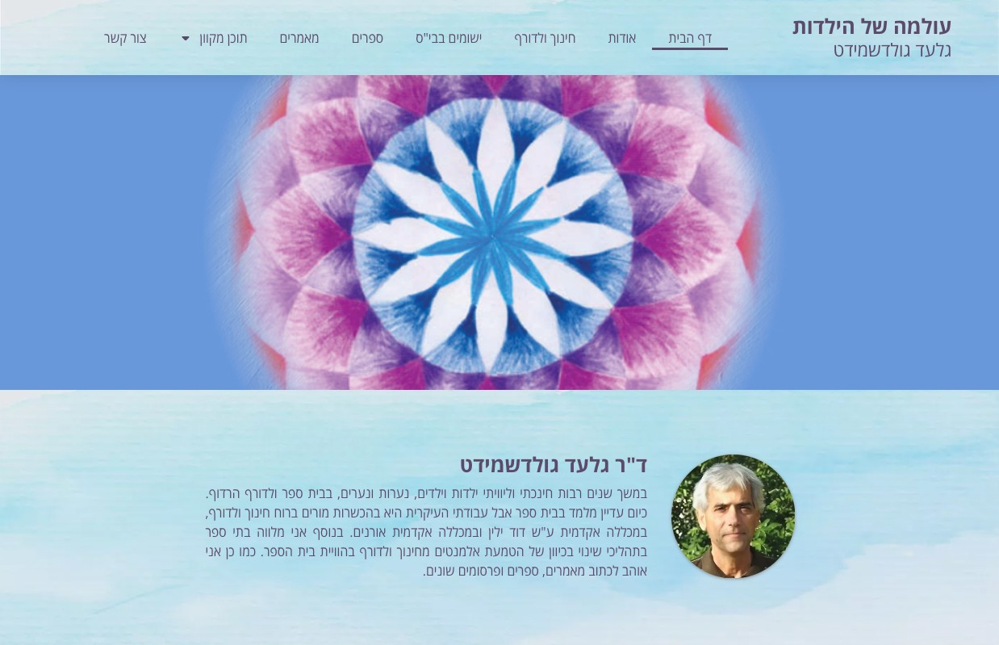

# SEO Recommendations — techspirit.co.il
**Date:** 03.06.2026  
**Site:** Single-page Hebrew RTL landing page for Oren Knaan (הטכנורוחניק), targeting spiritual business owners in Israel.  
**Sources:** Site audit (index.html, README), HeyTony Technical SEO transcript library.

---

## Priority Overview

| Priority | Category | Items |
|----------|----------|-------|
| 🔴 Critical | Foundation | robots.txt, sitemap.xml, Search Console, canonical |
| 🔴 Critical | Metadata | Open Graph, Twitter Card |
| 🟠 High | Structured Data | LocalBusiness schema, FAQ schema |
| 🟠 High | On-Page | H1 audit, alt text, NAP in footer |
| 🟡 Medium | Performance | Image optimization, Core Web Vitals |
| 🟡 Medium | Local SEO | Google Business Profile, directories |
| 🟢 Lower | Authority | EEAT signals, multi-platform presence |
| 🟢 Lower | Future | Blog content, lead magnet quiz |

---

## 🔴 CRITICAL — Do These First

### 1. Create `robots.txt`
**File:** `/robots.txt` at root of site.

```
User-agent: *
Allow: /
Disallow: /analytics/
Disallow: /thank-you/

Sitemap: https://techspirit.co.il/sitemap.xml
```

Without this file, Google has no explicit guidance. The `/analytics/` and `/thank-you/` pages are already marked `noindex` in their HTML, but `robots.txt` adds a second layer of protection and stops Google from wasting crawl budget on them. Pointing to the sitemap here also makes discovery faster.

---

### 2. Create `sitemap.xml`
**File:** `/sitemap.xml` at root of site.

```xml
<?xml version="1.0" encoding="UTF-8"?>
<urlset xmlns="http://www.sitemaps.org/schemas/sitemap/0.9">
  <url>
    <loc>https://techspirit.co.il/</loc>
    <changefreq>monthly</changefreq>
    <priority>1.0</priority>
  </url>
</urlset>
```

This is a single-page site — only the homepage should appear. Privacy, terms, thank-you, and analytics pages are all `noindex` and must be excluded from the sitemap. Submit this URL inside Google Search Console once the file is live.

---

### 3. Verify Google Search Console
**Action:** Go to [search.google.com/search-console](https://search.google.com/search-console) → Add property → choose **Domain property** (not URL Prefix — Domain tracks both `www` and non-`www`).

Once verified:
- Submit the sitemap at `https://techspirit.co.il/sitemap.xml`
- Check the **Pages** report to confirm `index.html` is indexed
- Monitor **Core Web Vitals** under Experience
- Check **Mobile Usability** report
- Use **Performance → Queries** to track which keywords bring impressions and clicks
- Run a **60-second weekly check**: Insights → Performance trend → Index health → one keyword to optimize

---

### 4. Add Canonical Tag to Homepage
**Add to `<head>` in `index.html`:**

```html
<link rel="canonical" href="https://techspirit.co.il/">
```

This prevents duplicate-content confusion between `techspirit.co.il`, `techspirit.co.il/index.html`, `www.techspirit.co.il`, and any `http://` variants. The JS redirect handles the browser, but canonical handles Google's crawler.

---

### 5. Add Open Graph Tags
**Add to `<head>` in `index.html`** (replace after the existing `<meta name="description">` tag):

```html
<!-- Open Graph -->
<meta property="og:type"        content="website">
<meta property="og:url"         content="https://techspirit.co.il/">
<meta property="og:title"       content="אתר לרוחך | אורן כנען - הטכנורוחניק">
<meta property="og:description" content="אתר שמדבר את השפה שלכם - לבעלי עסקים רוחניים, מטפלים ומנחות. בניית אתרים עם נשמה, על ידי אורן כנען - הטכנורוחניק.">
<meta property="og:image"       content="https://techspirit.co.il/Images/Assets/og-image.jpg">
<meta property="og:locale"      content="he_IL">
<meta property="og:site_name"   content="הטכנורוחניק">
```

**Also create the OG image:** Design a 1200×630px image — monk/teal background + the tagline "הטכנורוחניק" in large Secular One. Save as `Images/Assets/og-image.jpg`. This image appears when anyone shares the site on WhatsApp, Facebook, or LinkedIn. Crucial for word-of-mouth in a spiritual community.

---

### 6. Add Twitter / X Card Tags
**Add to `<head>` in `index.html`:**

```html
<!-- Twitter Card -->
<meta name="twitter:card"        content="summary_large_image">
<meta name="twitter:title"       content="אתר לרוחך | אורן כנען - הטכנורוחניק">
<meta name="twitter:description" content="אתר שמדבר את השפה שלכם - לבעלי עסקים רוחניים, מטפלים ומנחות. בניית אתרים עם נשמה.">
<meta name="twitter:image"       content="https://techspirit.co.il/Images/Assets/og-image.jpg">
```

---

## 🟠 HIGH PRIORITY

### 7. Add LocalBusiness + Person Structured Data (JSON-LD)
Schema markup is "Google's secret language." It tells Google exactly what your business is — without guessing. Pages with LocalBusiness schema show up with rich snippets (contact info, service area) directly in results, taking more real estate and getting more clicks. It also helps AI Overviews cite your site.

**Add before `</body>` in `index.html`:**

```html
<script type="application/ld+json">
{
  "@context": "https://schema.org",
  "@type": "LocalBusiness",
  "name": "הטכנורוחניק — אורן כנען",
  "alternateName": "Technospiritualist",
  "url": "https://techspirit.co.il/",
  "logo": "https://techspirit.co.il/Images/Assets/monk.webp",
  "image": "https://techspirit.co.il/Images/Assets/og-image.jpg",
  "description": "בניית אתרים לבעלי עסקים רוחניים, מטפלים ומנחות בישראל. אתרים עם נשמה שמדברים את השפה של הקהילה הרוחנית.",
  "telephone": "+972-54-475-7906",
  "email": "oren@techspirit.co.il",
  "address": {
    "@type": "PostalAddress",
    "addressCountry": "IL"
  },
  "areaServed": {
    "@type": "Country",
    "name": "Israel"
  },
  "priceRange": "₪₪",
  "sameAs": [
    "https://wa.me/972544757906"
  ],
  "founder": {
    "@type": "Person",
    "name": "אורן כנען",
    "jobTitle": "מעצב ובונה אתרים",
    "url": "https://techspirit.co.il/#about"
  }
}
</script>
```

---

### 8. Add FAQ Schema for the FAQ Section
The site already has an accordion FAQ. Wrap it in FAQ schema so Google can show those Q&As directly in search results (and AI Overviews can cite them). Pages with FAQ schema see a measurable lift in AI citations.

**Add before `</body>` in `index.html`** (fill in the actual questions and answers from the FAQ accordion):

```html
<script type="application/ld+json">
{
  "@context": "https://schema.org",
  "@type": "FAQPage",
  "mainEntity": [
    {
      "@type": "Question",
      "name": "[שאלה 1 מה-FAQ]",
      "acceptedAnswer": {
        "@type": "Answer",
        "text": "[תשובה 1]"
      }
    },
    {
      "@type": "Question",
      "name": "[שאלה 2 מה-FAQ]",
      "acceptedAnswer": {
        "@type": "Answer",
        "text": "[תשובה 2]"
      }
    }
  ]
}
</script>
```

---

### 9. Audit H1 Tags — One Per Page
Every page must have exactly one `<h1>` tag. Multiple H1s confuse Google and can hurt rankings. Run a quick search in `index.html`:

```bash
grep -i "<h1" index.html
```

The main landing page should have a single `<h1>` that contains the primary keyword phrase (e.g., "בניית אתרים לבעלי עסקים רוחניים"). Subsequent headings should be `<h2>` and `<h3>`.

---

### 10. Add Descriptive Hebrew Alt Text to All Images
**Affected files:** All `` tags in `index.html`.

Every portfolio screenshot, testimonial photo, and asset image needs a descriptive Hebrew `alt` attribute. This serves two purposes: accessibility (screen readers) and SEO (Google reads alt text to understand images).

Examples:
```html
<!-- Bad -->


<!-- Good -->


```

---

### 11. Fix HTTPS: Add Server-Level Redirect
Currently HTTPS is enforced via inline JS (`if(location.protocol==='http:')...`). This is a workaround — the page actually loads over HTTP first, then redirects. Google and Chrome see a brief HTTP load before the redirect fires.

**Recommended fix:** Ask your Israeli hosting provider to enable **301 redirect from HTTP to HTTPS** at the server/hosting panel level (usually a checkbox in cPanel under "Force HTTPS"). This makes the redirect happen before any content is served, which is safer and faster. The JS fallback can stay as a backup.

---

### 12. Consistent NAP in Footer (Name, Address, Phone)
Google cross-checks your business info across the entire internet. The phone number, name, and contact info on the site must be **character-for-character identical** to every other place it appears online (WhatsApp links, directories, any future Google Business Profile).

- Check that the footer displays: **אורן כנען | 054-4757906 | oren@techspirit.co.il**
- The WhatsApp link format `+972544757906` is fine in URLs, but the visible text on page should match the displayed format consistently
- If you ever register a Google Business Profile, the name must match exactly

---

## 🟡 MEDIUM PRIORITY

### 13. Run PageSpeed Insights / Lighthouse Audit
Go to [pagespeed.web.dev](https://pagespeed.web.dev) and test `https://techspirit.co.il/`. Google's Core Web Vitals targets:
- **LCP (Largest Contentful Paint):** under 2.5 seconds
- **INP (Interaction to Next Paint):** under 0.1 seconds
- **CLS (Cumulative Layout Shift):** under 0.1

53% of users leave if a page takes more than 3 seconds to load. Sites passing Core Web Vitals see 24% more engagement. Fix issues in this order: images → scripts → fonts.

---

### 14. Optimize Images
The `Images/` folder contains `.jpg`, `.jpeg`, and `.png` files alongside `.webp`. Heavy images are the single biggest speed killer on static sites.

**Actions:**
- Convert all remaining `.jpg`/`.jpeg`/`.png` portfolio images to `.webp` (30-50% smaller)
- Use `loading="lazy"` on all images below the fold (hero images should NOT have `lazy` — they're above the fold)
- Add explicit `width` and `height` attributes to every `` to prevent layout shift (CLS)

```html
<!-- Example -->

```

---

### 15. Minify Inline CSS and Enable Font Display Swap
The `index.html` file contains a large inline `<style>` block. While inline styles reduce render-blocking, they still benefit from minification.

Also, add `&display=swap` to the Google Fonts URL if not already present (it is — good). This ensures text renders immediately with a fallback font while the custom font loads, preventing invisible text during load.

**Optional long-term:** Self-hosting Heebo and Secular One eliminates the Google Fonts DNS lookup and gives you more control over caching. Use [google-webfonts-helper.herokuapp.com](https://google-webfonts-helper.herokuapp.com) to download the font files.

---

### 16. Set Up Google Business Profile (GBP)
For local Israeli searches like "בניית אתרים לרוחניים", the **Map Pack** (Google Maps results) appears above organic results. Without a GBP, you're invisible to that entire search surface.

**Actions:**
1. Go to [business.google.com](https://business.google.com) and create a profile
2. Category: "Web Designer" or "Internet Marketing Service"
3. Service area: Israel (since you work remotely, no physical storefront needed)
4. Fill out: business description in Hebrew, services, hours, link to `https://techspirit.co.il/`
5. Upload real photos: your portrait, screenshot examples, the monk/brand image
6. Use the **Services hidden menu** — add specific services (e.g., "בניית אתרים לגופות רוחניות") with 300-character Hebrew descriptions that include your main keywords. Google reads these as major ranking signals.
7. Ask happy clients to leave reviews — encourage them to mention specific services ("בניית אתר", "עיצוב אתר לתרפיסטית") in their text

---

### 17. Register on Israeli Local Directories
Citations (mentions of your business on external sites) are confirmation signals for Google that you're a real business. Consistency is critical — the name/phone must match exactly.

**Priority Israeli directories to register on:**
- `d.co.il` (דפי זהב / Yellow Pages Israel)
- `b144.co.il`
- `xnet.co.il`
- `zap.co.il`
- `mako.co.il` business listings
- LinkedIn company page
- Facebook business page (links back to site)

Use the exact same business name, phone, and website URL on every listing.

---

### 18. Answer the Primary Question in the First 150 Words
AI Overviews (and Google's ranking algorithm) prioritize content that answers the user's question immediately. The current hero section hooks with emotion, but the first 150 words of body copy should also clearly answer: **"מה אורן כנען עושה ולמי?"**

**Suggested addition** near the top of the hero or immediately after:
> "אני בונה אתרים לבעלי עסקים רוחניים, מטפלים ומנחות בישראל — אתרים שמדברים את השפה של הקהילה שלכם ומייצרים לידים אמיתיים."

This phrasing contains the primary keywords naturally and gives AI tools a clean, quotable answer.

---

## 🟢 LOWER PRIORITY (Important but Not Urgent)

### 19. EEAT Signals — Strengthen the About Section
Google evaluates Expertise, Experience, Authoritativeness, and Trustworthiness. The current About section is good, but can be strengthened:
- Add Oren's photo with an explicit `alt` like "אורן כנען, בונה אתרים עם 10+ שנות ניסיון"
- Mention specific credentials or years of experience in the very first sentence of the About section (not buried)
- The existing testimonials with real names and photos are an excellent EEAT signal — keep them prominent
- Consider adding a specific portfolio count: "50+ אתרים שהשקתי לעסקים רוחניים בישראל" is more trustworthy than a vague claim

---

### 20. Multi-Platform Presence for Entity Authority
Google uses "entity recognition" — it wants to confirm you're a real, consistent brand. Beyond the website, Google looks for mentions across the internet.

**Actions:**
- Ensure LinkedIn profile links to `techspirit.co.il`
- Ensure Facebook page exists with the same business name and links to the site
- When clients share their new sites on Instagram/Facebook, ask them to tag you — these social mentions build entity authority
- Encourage clients to mention "אורן כנען הטכנורוחניק" (not just "אורן") in their posts so Google connects the mentions to the entity

---

### 21. Plan a Blog / Content Section (Future)
A single landing page has a hard ceiling for organic traffic — one page can only rank for a handful of keywords. The planned lead magnet quiz is a good start, but a simple blog would dramatically expand keyword surface area.

**High-value content ideas for the Israeli spiritual market:**
- "כמה עולה אתר לעסק רוחני?" (costs article — directly answers a buyer search)
- "5 טעויות שבעלי עסקים רוחניים עושים עם האתר שלהם"
- "בניית אתר לתרפיסטית: מה חשוב לכלול"
- "הטכנורוחניק מסביר: למה קידום ממומן לא מספיק בלי אתר טוב"

These posts would each rank independently and funnel traffic back to the main CTA.

---

### 22. Implement `hreflang` When Adding English Content
Currently Hebrew-only — `hreflang` is not needed. If you ever add an English version for diaspora clients, add:
```html
<link rel="alternate" hreflang="he" href="https://techspirit.co.il/">
<link rel="alternate" hreflang="en" href="https://techspirit.co.il/en/">
```

---

## Quick-Win Checklist (Do This Week)

- [ ] Create `robots.txt` at site root
- [ ] Create `sitemap.xml` at site root  
- [ ] Add `<link rel="canonical" href="https://techspirit.co.il/">` to `index.html`
- [ ] Add Open Graph meta tags to `index.html`
- [ ] Add Twitter Card meta tags to `index.html`
- [ ] Verify site in Google Search Console (Domain Property)
- [ ] Submit sitemap in Search Console
- [ ] Add `alt` text to every image in `index.html`
- [ ] Add LocalBusiness JSON-LD schema to `index.html`
- [ ] Add FAQ JSON-LD schema to `index.html`
- [ ] Run PageSpeed Insights and note CWV score baseline
- [ ] Design and export the 1200×630 OG share image

---

*Compiled from: site audit of techspirit.co.il / index.html, and HeyTony SEO transcript library — Technical SEO tagged videos including "What is Technical SEO", "How to Fix SEO Errors That Kill Your Rankings", "4 Google Search Console Mistakes", "5 SEO Mistakes That Are Killing Your Small Business", "Outrank 99% of Websites", "SEO is Changing: 5 Things You Need to Do", "Google AI Mode Just Killed Old SEO Tactics", "The Fastest Way to Rank #1 on Google Maps", and "How to Rank for Near Me Searches".*
